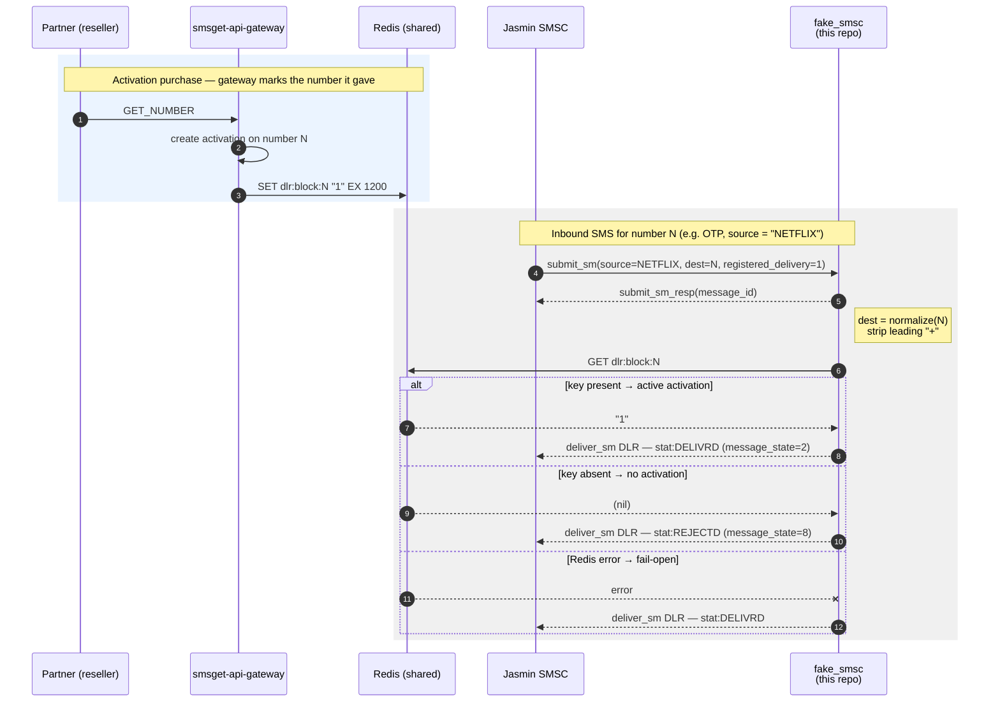

# Fake SMSC Server

A lightweight, asynchronous Fake SMSC (Short Message Service Center) server for testing SMPP (Short Message Peer-to-Peer) applications. This tool is designed to simulate an SMSC for development and testing purposes, particularly useful for testing SMS gateways like Jasmin.

## Features

- **Full SMPP 3.4 Protocol Support**: Implements core SMPP commands for message submission and delivery
- **Asynchronous Design**: Built with Python's `asyncio` for efficient handling of multiple concurrent connections
- **Activation-gated DLR Simulation**: Returns `DELIVRD` or `REJECTD` per message based on whether the destination number has an active activation (Redis `dlr:block:{number}`)
- **Fail-open**: If Redis is unavailable, accepts (`DELIVRD`) rather than rejecting legitimate traffic
- **Configurable**: Command-line options for host, port, and DLR delay
- **Comprehensive Logging**: Detailed logging of all SMPP operations

## Supported SMPP Operations

| Operation | Command ID | Description |
|-----------|------------|-------------|
| Bind Transmitter | `0x00000002` | Bind as message transmitter |
| Bind Receiver | `0x00000001` | Bind as message receiver |
| Bind Transceiver | `0x00000009` | Bind as both transmitter and receiver |
| Submit SM | `0x00000004` | Submit a short message |
| Deliver SM | `0x00000005` | Deliver a message (used for DLRs) |
| Enquire Link | `0x00000015` | Keep-alive/heartbeat |
| Unbind | `0x00000006` | Gracefully close connection |
| Generic NACK | `0x80000000` | Negative acknowledgement for unknown commands |

## Requirements

- Python 3.7+
- No external dependencies for core functionality

## Installation

Clone the repository:

```bash
git clone <repository-url>
cd dlr-smpp-python
```

## Usage

### Basic Usage

Start the server with default settings:

```bash
python fake_smsc.py
```

This starts the SMSC on `0.0.0.0:2776` with a 5-second DLR delay.

### Command-Line Options

```bash
python fake_smsc.py [OPTIONS]
```

| Option | Default | Description |
|--------|---------|-------------|
| `--host` | `0.0.0.0` | Host address to bind the server |
| `--port` | `2776` | Port number to listen on |
| `--dlr-delay` | `5` | Delay in seconds before sending DLR |

### Examples

**Custom port and DLR delay:**

```bash
python fake_smsc.py --port 2775 --dlr-delay 10
```

**Listen on localhost only:**

```bash
python fake_smsc.py --host 127.0.0.1 --port 2776
```

**Immediate DLR (no delay):**

```bash
python fake_smsc.py --dlr-delay 0
```

## How It Works

### Connection Flow

1. **Client connects** → Server accepts TCP connection
2. **Bind request** → Client sends bind (transmitter/receiver/transceiver)
3. **Bind response** → Server responds with system ID `FAKESMSC`
4. **Submit SM** → Client sends message
5. **Submit SM Response** → Server responds with unique message ID
6. **DLR (if requested)** → Server sends delivery receipt after configured delay
7. **Unbind** → Client gracefully disconnects

### Delivery Receipt Format

When a message is submitted with `registered_delivery` enabled, the server sends a DLR in the following format:

```
id:<message_id> sub:001 dlvrd:001 submit date:<YYMMDDhhmm> done date:<YYMMDDhhmm> stat:DELIVRD err:000 text:
```

The DLR is sent as a `deliver_sm` PDU with `esm_class=0x04` (delivery receipt indicator).

### DLR Gating (accept vs reject)

This harness simulates the carrier's accept/reject decision against live platform state:



- On `submit_sm`, it normalizes the **`destination_addr`** (our virtual number — digits only, leading `+` stripped) and checks Redis for `dlr:block:{number}`.
- The `smsget-api-gateway` sets that key (20-min TTL) when it creates an activation (`utils/redis-cache.js` → `markActiveReservation`).
- **Key present** → active activation → DLR `stat:DELIVRD` (`message_state=2`).
- **Key absent** → no activation → DLR `stat:REJECTD` (`message_state=8`).
- **Redis error** → fail-open: `DELIVRD`.

The DLR is only emitted when the `submit_sm` requested one (`registered_delivery & 0x01`), for both outcomes.

> Gotcha: the gate keys on the **destination** (the number we gave for the activation), not the source (the sender ID such as `NETFLIX`). The gateway writes digit-only keys (e.g. `dlr:block:79156537788`); both sides must agree on format or every message is rejected. Verify with `redis-cli MONITOR | grep dlr:block` (see `monitoring/DEPLOY.md` §0.6).

## Configuration

Redis connection is configured via environment (see `.env.example`):

| Variable | Default | Description |
|----------|---------|-------------|
| `REDIS_HOST` / `REDIS_PORT` / `REDIS_DB` | `localhost` / `6379` / `0` | Redis used for activation gating |
| `REDIS_USERNAME` / `REDIS_PASSWORD` | `default` / _(empty)_ | Redis auth |

## Architecture

### Classes

#### `FakeSMSC`

The main server class that manages TCP connections.

```python
class FakeSMSC:
    def __init__(self, host='0.0.0.0', port=2776, dlr_delay=5)
```

- `host`: Network interface to bind
- `port`: TCP port to listen on
- `dlr_delay`: Seconds to wait before sending DLR

#### `SMPPSession`

Handles individual SMPP client sessions.

**Key Methods:**

| Method | Description |
|--------|-------------|
| `read_pdu()` | Read and parse incoming PDU from socket |
| `write_pdu()` | Send PDU response to client |
| `parse_bind()` | Parse bind request parameters |
| `parse_submit_sm()` | Parse submit_sm message parameters |
| `send_dlr()` | Send delivery receipt after delay |
| `handle()` | Main session processing loop |

## Logging

The server logs all operations to stdout with timestamps:

```
2024-01-15 10:30:45,123 [INFO] Fake SMSC listening on 0.0.0.0:2776
2024-01-15 10:30:45,124 [INFO] DLR delay: 5 seconds
2024-01-15 10:30:50,456 [INFO] [CONNECT] ('192.168.1.100', 54321)
2024-01-15 10:30:50,789 [INFO] [BIND] system_id=jasmin
2024-01-15 10:30:51,012 [INFO] [SUBMIT_SM] 12345 -> 67890 msg_id=a1b2c3d4
2024-01-15 10:30:56,015 [INFO] [DLR SENT] msg_id=a1b2c3d4 stat=DELIVRD
```

## Testing with Jasmin SMS Gateway

This fake SMSC is particularly useful for testing [Jasmin SMS Gateway](https://jasminsms.com/). Configure Jasmin to connect to the fake SMSC:

```yaml
# Example Jasmin SMPP connector configuration
host: 127.0.0.1
port: 2776
username: test
password: test
```

## Integration Example

Here's a simple Python client example using `smpplib`:

```python
import smpplib.client
import smpplib.gsm

# Connect to fake SMSC
client = smpplib.client.Client('127.0.0.1', 2776)
client.connect()
client.bind_transceiver(system_id='test', password='test')

# Send a message
client.send_message(
    source_addr='12345',
    destination_addr='67890',
    short_message='Hello, World!',
    registered_delivery=True  # Request DLR
)

# The fake SMSC will send a DLR after the configured delay
```

## Limitations

- **No authentication**: Accepts any system_id/password combination
- **No message storage**: Messages are not persisted
- **DLR-only**: Sends delivery receipts (`esm_class=0x04`), not full MO message content
- **Two states**: Simulates `DELIVRD` and `REJECTD` only (driven by activation gating), not the full SMPP message-state set

## Contributing

Contributions are welcome! Please feel free to submit issues or pull requests.

## License

This project is open source. See the repository for license details.
